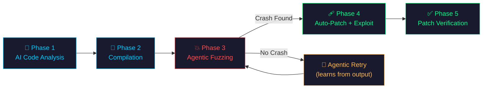

<div align="center">
  
  <h1>🧬 Mutagen</h1>
  <p><strong>AI-Powered Zero-Day Fuzzer & Auto-Patcher</strong></p>
  <p>
    <em>The world's first agentic AI fuzzer that reads source code, finds vulnerabilities,<br>
    generates exploits, patches the bugs, and proves the fix works — fully autonomously.</em>
  </p>

  <br>

  <a href="#-quick-start"></a>
  <a href="LICENSE"></a>
  <a href="https://www.python.org/"></a>

  <br><br>

  <a href="#-features">Features</a> •
  <a href="#-how-it-works">How It Works</a> •
  <a href="#-quick-start">Quick Start</a> •
  <a href="#-supported-llms">LLM Providers</a> •
  <a href="#-contributing">Contributing</a>
</div>

---

## ⚠️ Disclaimer

**For Educational and Defensive Purposes Only.**
Mutagen is designed to help developers find and patch vulnerabilities in their own code. Do not use this tool against targets you do not have explicit permission to test.

---

## 🤔 Why Mutagen?

Traditional fuzzers (AFL, libFuzzer, Honggfuzz) rely on **random mutation** and code coverage to find crashes. They're effective but require massive CPU time and often fail to bypass complex logic like authentication checks.

**Mutagen is different.** It uses an **Agentic Large Language Model** to:

1. **Read and understand** the target's source code
2. **Mathematically calculate** the exact payloads needed to trigger memory corruption
3. **Learn from failures** — if a payload doesn't crash, the AI analyzes the output and tries again
4. **Automatically patch** the vulnerability and **generate a proof-of-concept exploit**

> **The result?** Crashes found in seconds, not hours. Vulnerabilities patched automatically. Exploits generated for regression testing.

### Mutagen vs Traditional Fuzzers

| Feature | AFL/libFuzzer | Honggfuzz | **Mutagen** |
|---------|:------------:|:---------:|:-----------:|
| Mutation Strategy | Random bit-flip | Random + feedback | **AI-guided** |
| Source Code Understanding | ❌ | ❌ | **✅ Full analysis** |
| Bypasses Auth/Logic | ❌ | ❌ | **✅ Agentic retries** |
| Auto-Patch Generation | ❌ | ❌ | **✅** |
| Exploit (PoC) Generation | ❌ | ❌ | **✅** |
| Patch Verification | ❌ | ❌ | **✅** |
| Time to First Crash | Hours/Days | Hours | **Seconds** |
| Setup Complexity | High | Medium | **`pip install`** |

---

## ⚙️ How It Works

Mutagen executes a fully autonomous **5-phase zero-day hunting loop**:



| Phase | What Happens |
|-------|-------------|
| **1. AI Code Analysis** | The AI reads the target `.c` file, performs Chain-of-Thought reasoning, identifies vulnerabilities (buffer overflows, format strings, UAFs, etc.), and generates targeted payloads. |
| **2. Compilation** | The target is compiled with Mutagen's crash handler injected, which captures register state (EIP/RIP) at the point of crash. |
| **3. Agentic Fuzzing** | Payloads are injected concurrently. If a payload fails, the AI analyzes `stdout`, `stderr`, and exit codes, then generates refined payloads. This is the **agentic retry loop**. |
| **4. Auto-Patch & Exploit** | The AI writes a secure C patch AND a standalone Python PoC exploit script for regression testing. |
| **5. Patch Verification** | Mutagen compiles the patched code, fires the exploit at it, and mathematically proves the vulnerability is eliminated. |

---

## ✨ Features

- 🧠 **AI-Powered Analysis** — Understands code semantics, not just random fuzzing
- 🔄 **Agentic Retries** — Learns from `stdout/stderr` to bypass auth checks and complex logic
- 🩹 **Auto-Patching** — Generates secure C patches for every vulnerability found
- 💀 **Exploit Generation** — Writes standalone Python PoC scripts for regression testing
- ✅ **Patch Verification** — Proves the patch works by attacking the fixed binary
- 📊 **Beautiful HTML Reports** — Glassmorphism-styled interactive crash reports
- 🔌 **Multi-LLM Support** — Works with Gemini, OpenAI GPT-4, and local Ollama models
- ⚡ **Concurrent Execution** — Parallel payload injection with ThreadPoolExecutor
- 🌐 **Multiple Delivery Modes** — Args, stdin, and TCP socket fuzzing

### Supported Vulnerability Classes

| CWE | Vulnerability | Severity |
|-----|--------------|----------|
| [CWE-120](https://cwe.mitre.org/data/definitions/120.html) | Buffer Overflow | 🔴 Critical |
| [CWE-134](https://cwe.mitre.org/data/definitions/134.html) | Format String Bug | 🔴 Critical |
| [CWE-190](https://cwe.mitre.org/data/definitions/190.html) | Integer Overflow | 🟡 High |
| [CWE-416](https://cwe.mitre.org/data/definitions/416.html) | Use-After-Free | 🔴 Critical |
| [CWE-193](https://cwe.mitre.org/data/definitions/193.html) | Off-by-One Error | 🟡 High |
| [CWE-415](https://cwe.mitre.org/data/definitions/415.html) | Double Free | 🔴 Critical |

---

## 🚀 Quick Start

### Prerequisites

- **Python 3.10+**
- **A C Compiler** — GCC, MinGW, or TCC (bundled)
- **An API Key** — [Get a free Gemini key](https://aistudio.google.com/apikey) (or use OpenAI/Ollama)

### Install

```bash
# Clone
git clone https://github.com/yourusername/mutagen.git
cd mutagen

# Install
pip install -e .

# Set your API key
export GEMINI_API_KEY="your_key_here"          # Linux/macOS
$env:GEMINI_API_KEY="your_key_here"            # Windows PowerShell
```

### Environment Configuration (`.env`)

To avoid setting environment variables or flags on every invocation, you can create a local `.env` file in the root directory of the project:

```env
# Default provider (gemini, openai, or ollama)
MUTAGEN_PROVIDER=gemini
MUTAGEN_MODEL=gemini-2.5-flash-lite

# API Keys
MUTAGEN_API_KEY=your_key_here

# Alternatively, provider-specific keys:
# GEMINI_API_KEY=your_gemini_key
# OPENAI_API_KEY=your_openai_key
```

### Run

```bash
# Fuzz a single target
mutagen --target targets/01_buffer_overflow.c

# Or use python -m
python -m mutagen --target targets/01_buffer_overflow.c --max-payloads 5

# Fuzz ALL targets automatically
python run_all.py --max-payloads 3
```

### Output

Mutagen produces:
- 📄 **JSON crash report** in `crashes/`
- 🌐 **Interactive HTML report** in `crashes/`
- 🩹 **Patched C source** in `patches/`
- 💀 **Python exploit script** in `exploits/`

---

## 🔌 Supported LLMs

| Provider | Model | Setup | Cost |
|----------|-------|-------|------|
| **Google Gemini** (default) | `gemini-2.5-flash` | `export GEMINI_API_KEY=...` | Free tier available |
| **OpenAI** | `gpt-4o` | `pip install openai` + `export OPENAI_API_KEY=...` | Pay-per-use |
| **Ollama** (local) | `llama3.2`, `codellama`, etc. | [Install Ollama](https://ollama.ai) | Free (runs locally) |

```bash
# Use OpenAI GPT-4o
mutagen --target targets/01_buffer_overflow.c --provider openai --model gpt-4o

# Use local Ollama (no API key needed!)
mutagen --target targets/01_buffer_overflow.c --provider ollama --model llama3.2
```

---

## 📁 Project Structure

```
mutagen/
├── mutagen/               # Core Python package
│   ├── cli.py             # Command-line interface
│   ├── core.py            # 5-phase fuzzing orchestration
│   ├── compiler.py        # C compilation + crash handler injection
│   ├── executor.py        # Payload execution + crash detection
│   ├── reporter.py        # JSON/HTML report generation
│   └── engines/           # LLM provider integrations
│       ├── base.py        # Abstract engine interface
│       ├── gemini.py      # Google Gemini
│       ├── openai_engine.py # OpenAI GPT
│       └── ollama.py      # Local Ollama
├── targets/               # Intentionally vulnerable C programs
├── tests/                 # Unit test suite
├── docs/                  # Documentation
├── pyproject.toml         # Python packaging config
└── run_all.py             # Batch fuzzer for all targets
```

---

## 🧪 Testing

```bash
# Install dev dependencies
pip install -e ".[dev]"

# Run all tests
pytest tests/ -v

# Run with coverage
pytest tests/ -v --cov=mutagen

# Lint
ruff check mutagen/
```

---

## 🤝 Contributing

Contributions are welcome! See [CONTRIBUTING.md](CONTRIBUTING.md) for guidelines.

**Easy ways to contribute:**
- 🎯 Add new vulnerable C targets to `targets/`
- 🔌 Add new LLM engine integrations
- 📝 Improve documentation
- 🐛 Report bugs or request features

---

## 📜 License

This project is licensed under the [MIT License](LICENSE).

---

## 🙏 Acknowledgments

- [Google Gemini](https://ai.google.dev/) for the AI backbone
- [Rich](https://github.com/Textualize/rich) for beautiful terminal output
- [SANS Institute](https://www.sans.org/) for cybersecurity education
- The open-source security community

---

<div align="center">
  <br>
  <em>"Evolution through mutation."</em>
  <br><br>
  <strong>Built by Aaron Alva</strong>
  <br>
  <sub>If Mutagen helped you, consider giving it a ⭐</sub>
</div>
